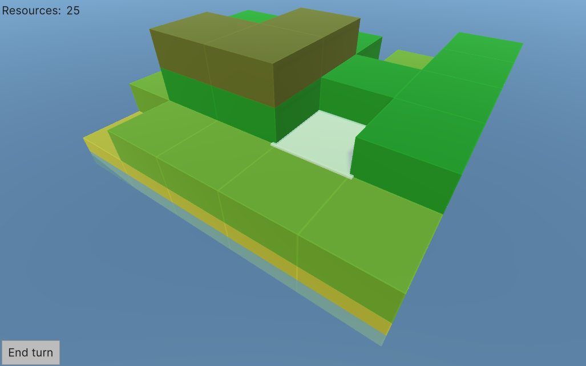

# ludum-jam-50

The Survivor Island
====================
The game about saving the island as long as it's possible.
The island is drowning: every turn water level is raising and part of the island disappears. You need to act smart to prolong your existence.


The Island
--------------
Island is:
* random-generator piece of land of NxN cells (5x5 by default),
* with different height: from 0 to M (0-3 by default). 
* after land generation 80% of the initial island land should be visible (x>0).

The Drowning
----------------
Island is surrounded by water, and each turn water level is raised +1 - or height of island is reduced -1, depends on a point of view. For example:
```
00000
03330
02120
03330
00000
```
-> turns into ->
```
00000
02220
01010
02220
00000
```

There are 2 options of realisation:
1) water is raised everywhere, including non-connected regions of island, so that the central cell of the upmentioned example is flood as well;
2) water is raised only in connected cells: so that the central cell is not flood yet in the upmentioned examples. Thus, there should be a flag for marking if the cell is flood or not.

Player
-----------------
* Player's goal is to prevent island drowning as long as it's possible.
* Player can raise +1 height on a cell 3x times per turn.
* Player is not presented on an actual map.

Resources
-----------------
* Each turn unflooded cells generate resource units
* Height rise requires K resource units (3 by default)
* Already flooded cells are not raisable

Colorification
-----------------
* Water is bluish
* Unflooded cells are green to yellow (0->N)
